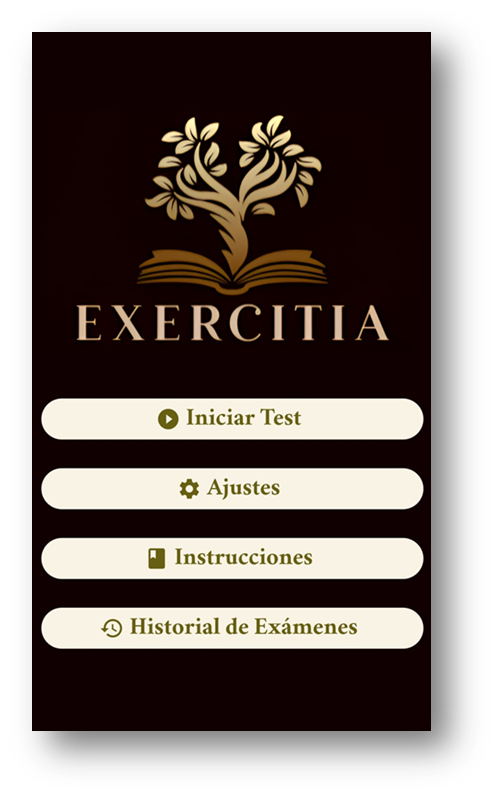

# Exercitia App  (en desarrollo)

<section style="display: flex; align-items: center; padding: 2rem;">
  

    <h2>Creadores</h2>
      <ul>
      <li><b>Marina Salvador Gimeno</b> (Dra. en Filología Clásica por la Universidad Complutense de Madrid, España).</li> 
      <li><b>José Guerra Carmenate</b> (Ingeniero en telecomunicaciones y electrónica por la Universidad de Pinar del Río, Cuba).</li>
    </ul>

  

  

    
  

</section>

Exercitia ha sido concebida como una herramienta de apoyo para el aprendizaje del latín, dirigida tanto a estudiantes de educación secundaria como del ámbito universitario. Aunque centrada en el estudio de la morfología, la aplicación aborda también cuestiones sintácticas y semánticas, con el fin de ofrecer una comprensión lo más completa y articulada posible de la lengua.

El contenido morfológico se organiza en cinco grandes categorías -morfología nominal, adjetival, verbal, pronominal y adverbial-, subdivididas, a su vez, en unidades específicas (por ejemplo, dentro de la morfología nominal: 1ª declinación, 2ª declinación, 3ª declinación tema en –i, 3ª declinación tema en consonante, 4ª y 5ª declinación, declinación grecolatina). El usuario puede seleccionar una o varias unidades, incluso de distintas categorías, según los temas que le resulten más complejos, propiciando de este modo un aprendizaje personalizado y adecuado a sus necesidades.

  
  

Los ejercicios, elaborados y revisados por especialistas en Filología clásica, presentan distintas tipologías y niveles de dificultad. 

  
  

Las soluciones van acompañadas de una explicación detallada que facilita la comprensión de cada pregunta. De este modo el alumno podrá consolidar los contenidos impartidos en clase o estudiados de forma autónoma en un entorno riguroso, accesible y pedagógicamente estimulante. 

  
  

Exercitia es una aplicación de acceso libre, lo que la convierte en una opción idónea para estudiantes y docentes que buscan un recurso fiable y de calidad para el estudio del latín. 

Actualmente, el sitio se encuentra en desarrollo. 
Agradecemos su interés y esperamos poder ofrecer próximamente una primera versión operativa.
